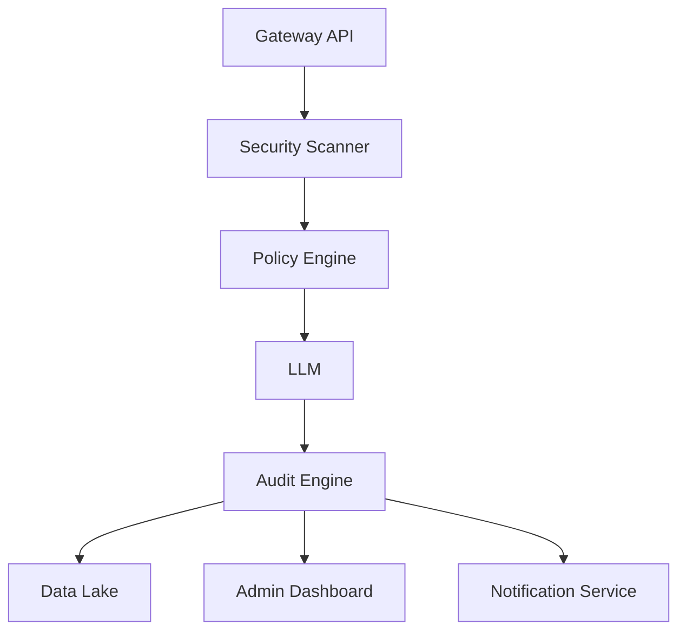
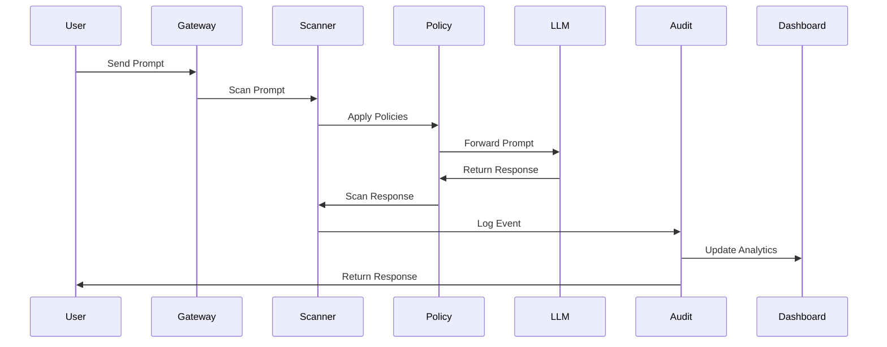

# Mindria LLM Security Platform: Architecture Overview

## Introduction
Mindria is a pioneering company in the field of large language model (LLM) auditing and security. As organizations increasingly adopt LLMs for a variety of business-critical applications, the need for robust, transparent, and secure AI systems has never been greater. Mindria’s platform is designed to address these needs by providing a comprehensive suite of tools and services that ensure the safe, compliant, and robust deployment of LLMs in enterprise environments.

This document provides an in-depth overview of the Mindria LLM Security Platform’s architecture, including its core components, data flow, security features, deployment options, scalability considerations, and integration capabilities. It is intended for developers, security professionals, compliance officers, and business stakeholders who are evaluating or implementing Mindria’s solutions.

---

## Table of Contents
1. System Components
2. Data Flow and Processing Pipeline
3. Security Features
4. Deployment Models
5. Scalability and High Availability
6. Integration and Extensibility
7. Monitoring and Observability
8. Compliance and Auditability
9. Business Value and Use Cases
10. Future Roadmap

---

## 1. System Components
Mindria’s platform is composed of several modular components, each responsible for a specific aspect of LLM security and auditing. The primary components are:

- **Gateway API**: The entry point for all LLM requests. It enforces authentication, rate limiting, and initial request validation.
- **Security Scanner**: Analyzes both prompts and responses for sensitive data, prompt injection, and other security risks using a combination of rule-based and ML-driven techniques.
- **Audit Engine**: Logs all LLM interactions, including metadata, user context, and security events. Supports real-time and batch analysis.
- **Policy Engine**: Applies customizable security and compliance policies to every request and response.
- **Admin Dashboard**: A web-based interface for monitoring, analytics, incident management, and policy configuration.
- **Data Lake**: Stores raw and processed logs, audit trails, and compliance artifacts for long-term retention and analysis.
- **Notification Service**: Sends alerts and notifications to security teams via email, Slack, or SIEM integrations.

### Component Diagram

---

## 2. Data Flow and Processing Pipeline
The typical data flow in Mindria’s platform is as follows:

1. **User Request**: A user or application sends a prompt to the Gateway API.
2. **Authentication & Validation**: The Gateway API authenticates the request and performs basic validation.
3. **Security Scanning**: The Security Scanner inspects the prompt for sensitive data, prompt injection, and policy violations.
4. **Policy Enforcement**: The Policy Engine applies organization-specific rules, such as redacting PII or blocking certain queries.
5. **LLM Processing**: The sanitized prompt is forwarded to the LLM (hosted or third-party).
6. **Response Scanning**: The response from the LLM is scanned for sensitive data or policy violations.
7. **Audit Logging**: All interactions, including metadata and security events, are logged by the Audit Engine.
8. **Notification**: If a security or compliance event is detected, the Notification Service alerts the appropriate personnel.
9. **Dashboard & Analytics**: All data is available in real-time via the Admin Dashboard for monitoring and analysis.

### Sequence Diagram

---

## 3. Security Features
Mindria’s platform is built with security at its core. Key features include:

- **Prompt Filtering**: Detects and blocks malicious or non-compliant prompts before they reach the LLM.
- **Response Redaction**: Automatically redacts sensitive information from LLM outputs.
- **Role-Based Access Control (RBAC)**: Ensures only authorized users can access specific features or data.
- **End-to-End Encryption**: All data in transit and at rest is encrypted using industry best practices.
- **Anomaly Detection**: Uses ML models to detect unusual patterns in LLM usage that may indicate abuse or compromise.
- **Comprehensive Audit Trails**: Every action is logged for forensic analysis and compliance reporting.
- **Custom Policy Engine**: Organizations can define their own security and compliance rules using a flexible policy language.

---

## 4. Deployment Models
Mindria supports multiple deployment options to meet the needs of different organizations:

- **Cloud (SaaS)**: Fully managed by Mindria, with automatic updates and scaling.
- **On-Premises**: Deployed within the customer’s own infrastructure for maximum control and data residency.
- **Hybrid**: Sensitive components (e.g., Audit Engine, Data Lake) on-premises, with other services in the cloud.

All components are containerized using Docker and orchestrated with Kubernetes for easy deployment and scaling.

---

## 5. Scalability and High Availability
Mindria’s architecture is designed for horizontal scalability and high availability:

- **Stateless Services**: Most components are stateless and can be scaled independently.
- **Load Balancing**: Gateway API and other services are fronted by load balancers.
- **Distributed Data Lake**: Supports sharding and replication for large-scale data storage.
- **Disaster Recovery**: Automated backups and multi-region support ensure business continuity.

---

## 6. Integration and Extensibility
Mindria integrates seamlessly with existing enterprise systems:

- **SIEM Integration**: Export audit logs to Splunk, QRadar, or other SIEM platforms.
- **Identity Providers**: Supports SSO via SAML, OAuth, and LDAP.
- **Custom Connectors**: SDKs and APIs for integrating with custom applications.
- **Webhooks**: Real-time event notifications for incident response automation.

---

## 7. Monitoring and Observability
Comprehensive monitoring is provided via:

- **Metrics**: Prometheus-compatible metrics for all services.
- **Logging**: Centralized log aggregation and search.
- **Dashboards**: Grafana dashboards for real-time visibility.
- **Alerting**: Configurable alerts for security and operational events.

---

## 8. Compliance and Auditability
Mindria is designed to help organizations meet regulatory requirements:

- **GDPR, HIPAA, SOC 2**: Built-in features for data minimization, consent management, and audit trails.
- **Automated Compliance Reports**: Generate reports for auditors with a single click.
- **Data Retention Policies**: Configurable retention and deletion schedules.

---

## 9. Business Value and Use Cases
Mindria delivers value across multiple domains:

- **Financial Services**: Ensure LLM usage complies with banking regulations.
- **Healthcare**: Protect patient data and support HIPAA compliance.
- **Legal**: Maintain confidentiality and privilege in legal workflows.
- **General Enterprise**: Prevent data leaks and ensure responsible AI usage.

### Example Use Case: Financial Institution
A major bank uses Mindria to monitor all LLM interactions for compliance, automatically redact sensitive data, and generate audit reports for regulators.

---

## 10. Future Roadmap
Mindria is committed to continuous innovation:

- **Real-Time Anomaly Detection**: Advanced ML models for detecting novel threats.
- **Expanded Language Support**: Support for non-English LLMs and multilingual compliance.
- **Mobile Admin Dashboard**: Manage and monitor from any device.
- **Customer Training Portal**: On-demand training for security and compliance teams.

---

## Conclusion
Mindria’s LLM Security Platform provides a comprehensive, scalable, and secure solution for organizations deploying large language models. With its modular architecture, robust security features, and deep compliance capabilities, Mindria empowers enterprises to harness the power of AI safely and responsibly.

For more information, contact Mindria at info@mindria.com or visit our website.

---
